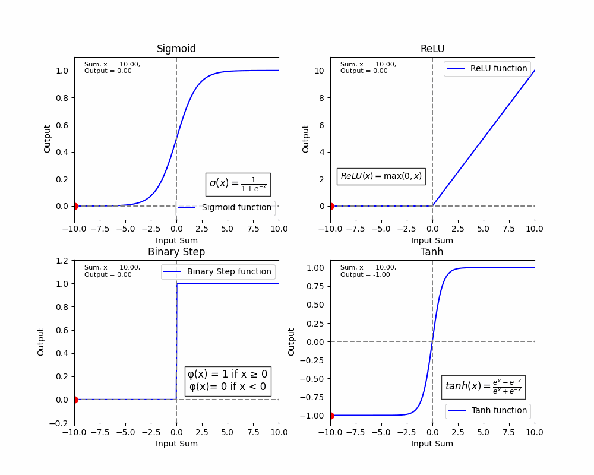

# activation_functions
Neural Network activation functions animation. Featuring Sigmoid, ReLU, Binary Step Function, and Tanh functions. 

To use the ActivationFunctions.py, make sure to install matplotlib and numpy.

